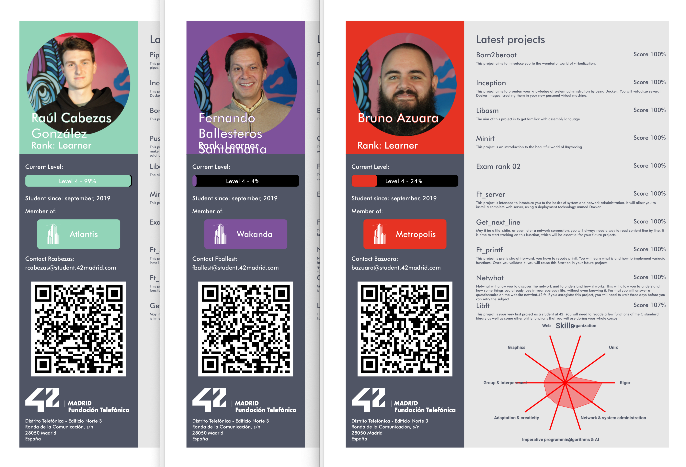

# Shadow PDF
A 42 Madrid resume generator.

## Requirements
+ wget to get images from cdn```brew install wget```
+ All de gems in gemfile ```bundle install```
+ Imagemagick. Installed by default in most unix os like MacOS or Linux
+ A ```secret.credentials.yml``` file int the same folder as the app, formatted as follows:

```
api:
  client_id: "your_client_id"
  client_secret: "your_client_secret"

```
If you don't know how or where to get this, please generate a new pair [here](https://profile.intra.42.fr/oauth/applications).


## Usage
```
./main.rb LOGIN
```
It will output a pdf inside current folder named LOGINapi_cv.pdf
Colors are based on current coalition. Enjoy!

## Sample
